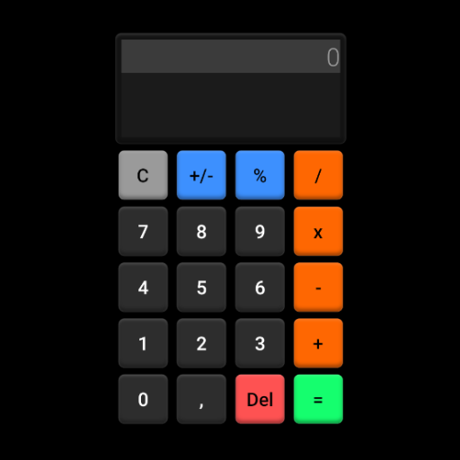

<div align="center">



# 📱 Calculadora

**Aplicación de calculadora móvil para Android, desarrollada con React Native CLI y TypeScript.**


</div>

---

## 📸 Capturas de pantalla

<div align="center">
  
  &nbsp;&nbsp;&nbsp;
  
</div>

---

## ✨ Funcionalidades

### Operaciones matemáticas
- **Suma** `+`, **Resta** `-`, **Multiplicación** `x`, **División** `÷`
- **Porcentaje** `%` — convierte el número actual a su equivalente decimal (ej: `25 → 0.25`)
- **Cambio de signo** `+/-` — alterna entre positivo y negativo
- **Decimal** `,` — permite ingresar números con decimales

### Display inteligente
- **Fórmula en tiempo real** — muestra la expresión completa mientras se construye, ej: `1.000 + 2.500 x 3`
- **Subtotal dinámico** — aparece en la parte superior del display una vez que se presiona un operador, y se actualiza en vivo mientras se escribe el siguiente número
- **Formato de miles** — los números se muestran con punto como separador de miles y coma como separador decimal, estilo colombiano / europeo (ej: `1.000.000,50`)
- **Animación de resultado** — al presionar `=` la fórmula cae con una animación suave antes de mostrar el resultado final

### Controles adicionales
- **`C`** — limpia toda la operación y reinicia la calculadora
- **`Del`** — borra el último dígito ingresado o el último operador
- **`=`** — calcula el resultado final con animación

### Manejo de errores
- División por cero muestra `Error` en pantalla en lugar de bloquear la app
- Límite de **12 dígitos** por número para evitar desbordamiento visual
- No permite ingresar dos comas decimales en el mismo número
- Si el operador se presiona varias veces seguidas, se reemplaza por el último sin duplicar

---

## 🗂️ Estructura del proyecto

```
Calculadora/
├── src/
│   ├── assets/
│   │   ├── IconKitchen-Output/     # Íconos de la app en todas las densidades
│   │   └── screenshot/             # Capturas de pantalla
│   ├── components/
│   │   └── ButtonCalculadora.tsx   # Componente reutilizable de botón con efecto press
│   ├── hooks/
│   │   └── useCalculadora.ts       # Lógica completa de la calculadora (custom hook)
│   ├── screens/
│   │   └── CalculadoraScreen.tsx   # Pantalla principal con layout y animaciones
│   └── theme/
│       └── global-theme.ts         # Colores, estilos y StyleSheet global
├── App.tsx                         # Punto de entrada, monta la pantalla principal
├── index.js                        # Entry point de React Native
└── package.json
```

### Descripción de archivos clave

| Archivo | Responsabilidad |
|---|---|
| `useCalculadora.ts` | Toda la lógica: construir números, parsear expresiones, calcular, formatear display |
| `CalculadoraScreen.tsx` | Layout de la UI, grid de botones, animación del `=` |
| `ButtonCalculadora.tsx` | Botón reutilizable con feedback visual (opacidad + escala al presionar) |
| `global-theme.ts` | Paleta de colores y estilos compartidos con `StyleSheet.create` |

---

## 🛠️ Requisitos previos

Antes de instalar asegúrate de tener configurado el entorno de React Native.

| Herramienta | Versión mínima |
|---|---|
| Node.js | >= 18 |
| Java JDK | 17 |
| Android SDK | API 24+ |
| React Native CLI | 15.0.1 |

> Si es la primera vez configurando React Native, sigue la guía oficial:
> https://reactnative.dev/docs/set-up-your-environment

---

## 🚀 Instalación y ejecución local

### 1. Clonar el repositorio

```bash
git clone https://github.com/JesusAlbertoVeraPompa/CalculadoraAppReactNative.git
```
Entras en la Carpeta del Repositorio

### 2. Instalar dependencias

```bash
npm install
```

### 3. Iniciar el servidor Metro

```bash
npm start
# o
npx react-native start
```

### 4. Correr en dispositivo / emulador Android

En una terminal separada:

```bash
npm run android
# o
npx react-native run-android
```

> Asegúrate de tener un emulador Android corriendo o un dispositivo físico conectado con **depuración USB activada**.

---

## 📦 Generar APK de producción

### Paso 1 — Crear el Keystore (solo la primera vez)

Ejecuta este comando en la raíz del proyecto para generar tu firma digital:

```bash
keytool -genkeypair -v -storetype PKCS12 \
  -keystore my-upload-key.keystore \
  -alias my-key-alias \
  -keyalg RSA -keysize 2048 -validity 10000
```

Mueve el archivo generado a `android/app/`:

```bash
mv my-upload-key.keystore android/app/
```

> ⚠️ **Guarda bien este archivo y sus contraseñas.** Sin él no podrás actualizar la app en Google Play.

### Paso 2 — Configurar `android/gradle.properties`

Agrega al final del archivo:

```properties
MYAPP_UPLOAD_STORE_FILE=my-upload-key.keystore
MYAPP_UPLOAD_KEY_ALIAS=my-key-alias
MYAPP_UPLOAD_STORE_PASSWORD=tu_contraseña
MYAPP_UPLOAD_KEY_PASSWORD=tu_contraseña
```

> ⚠️ Agrega `android/gradle.properties` al `.gitignore` para no exponer tus contraseñas.

### Paso 3 — Configurar `android/app/build.gradle`

Dentro del bloque `android { ... }` agrega la configuración de firma y referencíala en el buildType release:

```gradle
android {
    ...
    signingConfigs {
        release {
            if (project.hasProperty('MYAPP_UPLOAD_STORE_FILE')) {
                storeFile file(MYAPP_UPLOAD_STORE_FILE)
                storePassword MYAPP_UPLOAD_STORE_PASSWORD
                keyAlias MYAPP_UPLOAD_KEY_ALIAS
                keyPassword MYAPP_UPLOAD_KEY_PASSWORD
            }
        }
    }
    buildTypes {
        release {
            signingConfig signingConfigs.release   // ← agregar esta línea
            minifyEnabled false
            proguardFiles getDefaultProguardFile("proguard-android.txt"), "proguard-rules.pro"
        }
    }
}
```

### Paso 4 — Generar el APK

```bash
cd android
./gradlew assembleRelease
```

El APK firmado quedará en:

```
android/app/build/outputs/apk/release/app-release.apk
```

### (Opcional) Generar AAB para Google Play

Si quieres subir a la Play Store, genera el bundle en lugar del APK:

```bash
cd android
./gradlew bundleRelease
```

El AAB quedará en:

```
android/app/build/outputs/bundle/release/app-release.aab
```

### Solución de problemas comunes

| Error | Solución |
|---|---|
| `JAVA_HOME not set` | Instalar JDK 17 y configurar la variable de entorno |
| `SDK location not found` | Crear `android/local.properties` con `sdk.dir=/ruta/Android/Sdk` |
| Build correcto pero sin APK | Verificar que `signingConfig signingConfigs.release` esté en `buildTypes.release` |
| Error de caché | Ejecutar `cd android && ./gradlew clean` antes de volver a compilar |

---

## 🧰 Scripts disponibles

| Comando | Descripción |
|---|---|
| `npm start` | Inicia el servidor Metro |
| `npm run android` | Corre la app en Android (modo debug) |
| `npm run ios` | Corre la app en iOS (modo debug) |
| `npm run lint` | Analiza el código con ESLint |
| `npm test` | Ejecuta los tests con Jest |

---

## 📦 Dependencias principales

| Paquete | Versión | Uso |
|---|---|---|
| `react` | 18.3.1 | Librería base |
| `react-native` | 0.76.5 | Framework móvil |
| `react-native-paper` | ^5.15.0 | Componentes UI Material Design |
| `react-native-safe-area-context` | ^5.7.0 | Manejo de áreas seguras (notch, barra de estado) |
| `react-native-vector-icons` | ^10.3.0 | Íconos vectoriales |
| `typescript` | 5.0.4 | Tipado estático |

---

## 📄 Licencia

Este proyecto es de uso privado. Todos los derechos reservados.
